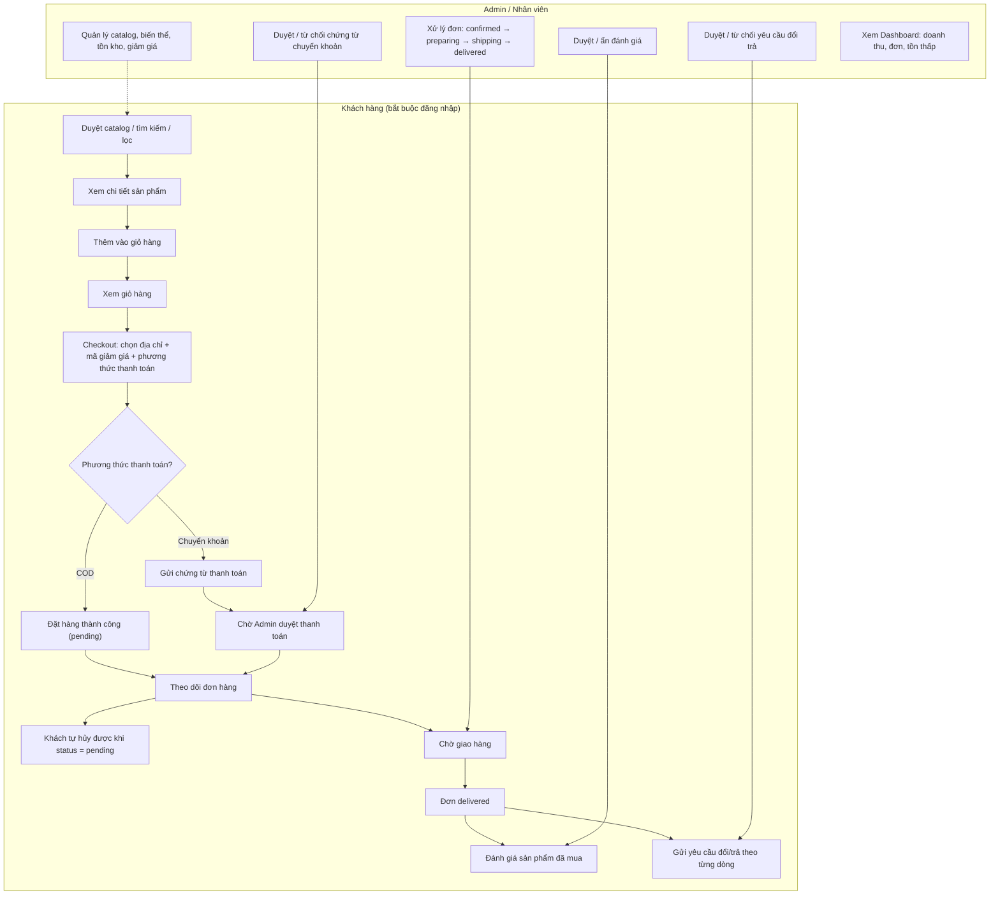
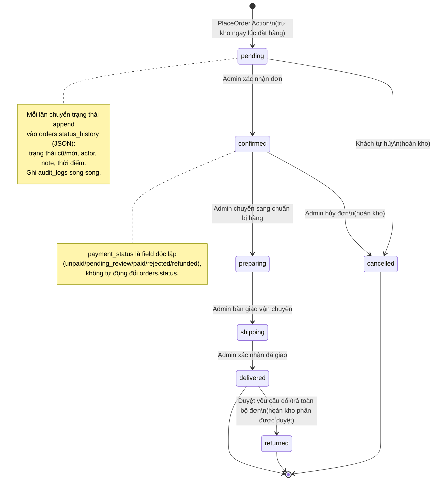
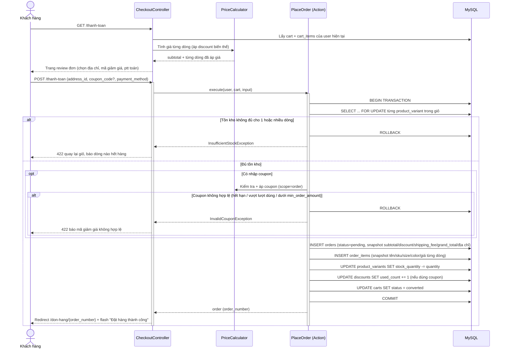
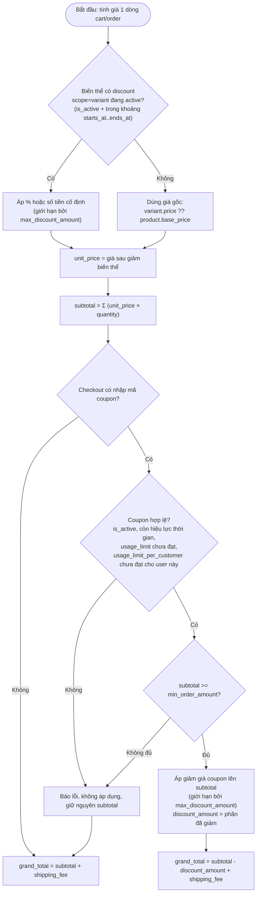
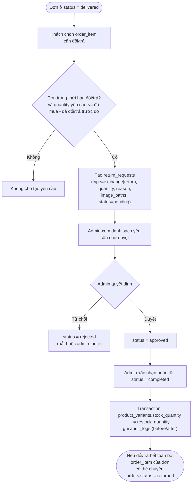

# Sơ đồ nghiệp vụ — Giai đoạn 3-7

Đây là phần "siết" tiếp theo của [`IMPLEMENTATION_SPEC.md`](IMPLEMENTATION_SPEC.md): thay vì mô tả bằng câu chữ, các luồng có nhiều nhánh rẽ hoặc nhiều bên liên quan được chốt bằng sơ đồ để 3 người (xem [`TEAM_SPLIT.md`](TEAM_SPLIT.md)) hiểu **giống hệt nhau** trước khi viết code — tránh tình trạng mỗi người hiểu một kiểu rồi phải sửa lại khi tích hợp. Số liệu/tên bảng/cột đều bám theo [`fashion-store-plan.md`](../fashion-store-plan.md) §3; nếu sơ đồ và plan lệch nhau, plan là nguồn đúng, báo lại để cập nhật sơ đồ.

Quy ước đọc: khối `alt`/`opt` trong sequence diagram là nhánh rẽ bắt buộc phải xử lý (không được bỏ qua case lỗi); mọi thao tác `INSERT/UPDATE` liệt kê trong 1 transaction phải nằm trong **cùng một `DB::transaction()`**.

## 1. Tổng quan luồng nghiệp vụ

Bức tranh toàn cảnh: khách hàng (bắt buộc đăng nhập, xem quyết định ở plan §"Quy tắc nghiệp vụ") đi từ catalog đến sau-bán-hàng, song song với các thao tác admin tương ứng ở từng bước.

**Chốt lại**: không có nhánh nào cho khách vãng lai; mọi mũi tên trong khối `KH` đều đứng sau middleware `auth`.

## 2. Trạng thái đơn hàng (`orders.status`)

State machine đầy đủ của một đơn — người/hành động nào kích hoạt mỗi cạnh, và tác dụng phụ đi kèm. Đây là sơ đồ quan trọng nhất vì `Admin/OrderController` (Người 2), `PlaceOrder` (Người 2), `Actions/ApproveReturnRequest` (Người 3) và Dashboard (Người 3) đều đọc/ghi field này.

**Chốt lại**:
- Không có cạnh nào bỏ qua bước (vd. `pending` không thể nhảy thẳng sang `shipping`).
- `cancelled`/`returned`/`delivered` là trạng thái cuối — không có UI cho phép chuyển tiếp từ đó (trừ `delivered → returned` qua đúng luồng đổi/trả ở sơ đồ 5).
- Hoàn kho chỉ xảy ra ở 2 cạnh: hủy đơn (`→ cancelled`) và duyệt đổi/trả (`→ returned`) — cả hai đều phải chạy trong transaction kèm ghi `audit_logs`.

## 3. Checkout — trình tự giao dịch (`Actions/PlaceOrder`)

Đây là điểm rủi ro race-condition/tiền bạc cao nhất trong toàn hệ thống, nên chốt cứng thứ tự từng câu lệnh thay vì để mỗi người tự suy diễn.

**Chốt lại**:
- `SELECT ... FOR UPDATE` chạy **trước** mọi kiểm tra khác (kể cả coupon) — khóa tồn kho là ưu tiên số 1 để chống bán vượt tồn khi nhiều người checkout cùng lúc.
- Coupon không hợp lệ hay hết hàng đều `ROLLBACK` toàn bộ — không có trạng thái đơn hàng "nửa vời".
- `carts.status = converted` (không xóa cart) để giữ lịch sử; giỏ mới sẽ được tạo ở lần thêm hàng tiếp theo.

## 4. Tính giá & áp dụng giảm giá (`Services/PriceCalculator`)

Người 2 sở hữu service này (xem `TEAM_SPLIT.md`); Người 1 (hiển thị giá ở catalog/giỏ hàng) và Người 3 (test coupon admin) chỉ gọi lại, không viết logic riêng. Sơ đồ này là "hợp đồng" giữa 3 người.

**Chốt lại**:
- Giảm giá biến thể (`scope=variant`) luôn tính **trước**, ảnh hưởng `unit_price` từng dòng; coupon (`scope=order`) tính **sau**, ảnh hưởng `subtotal` toàn đơn — hai loại không cộng dồn theo cách khác.
- `usage_limit_per_customer` kiểm tra theo **user hiện tại**, không phải tổng toàn hệ thống (đó là `usage_limit`).
- Kết quả cuối luôn là 2 số: `discount_amount` và `grand_total` — đây chính là 2 cột snapshot vào `orders`/`order_items`, không tính lại khác đi ở bất kỳ đâu khác (kể cả hiển thị hoá đơn sau này).

## 5. Đổi/trả hàng

**Chốt lại**:
- `quantity yêu cầu <= đã mua - đã đổi/trả trước đó` nghĩa là phải cộng dồn các `return_requests` cũ của cùng `order_item` (kể cả những cái `rejected` không tính, chỉ trừ những cái đã `approved`/`completed`) trước khi cho tạo yêu cầu mới.
- `approved` và `completed` là 2 bước tách biệt (duyệt về mặt quyết định, xong về mặt vận hành — vd. nhận lại hàng vật lý) — chỉ `completed` mới hoàn kho, không hoàn kho ngay lúc `approved`.
