<div align="center">

# Fashion Store

**Cửa hàng thời trang server-rendered bằng Laravel, kèm khu vực quản trị catalog và nhập kho.**

[](https://github.com/Thinha1/fashion-store/actions/workflows/ci.yml)
[](https://sonarcloud.io/summary/new_code?id=Thinha1_fashion-store)


</div>

## Tổng quan

Fashion Store là ứng dụng Laravel monolith phục vụ hai nhóm người dùng:

- **Khách hàng** duyệt sản phẩm, lọc theo danh mục hoặc thương hiệu, xem biến thể và quản lý tài khoản.
- **Nhân viên quản trị** quản lý catalog, nhà cung cấp, giảm giá và phiếu nhập trong phạm vi quyền được cấp.

Ứng dụng dùng Blade để render phía server. Tailwind CSS, Alpine.js và Font Awesome cung cấp giao diện cùng các tương tác nhẹ; dữ liệu nghiệp vụ được lưu trong MySQL.

Các model cho giỏ hàng, đơn hàng, đánh giá, yêu thích và trả hàng đã có trong nền tảng dữ liệu. Luồng mua hàng hoàn chỉnh và giao diện cho các phần này chưa được triển khai.

## Chức năng hiện có

### Cửa hàng

- Trang chủ với sản phẩm nổi bật.
- Danh sách sản phẩm có phân trang, lọc danh mục ba cấp, lọc thương hiệu và sắp xếp.
- Chi tiết sản phẩm với thư viện ảnh, màu sắc, kích thước, SKU, tồn kho và sản phẩm liên quan.
- Trang bộ sưu tập theo thương hiệu.
- Đăng ký, đăng nhập, xác minh email và đặt lại mật khẩu.
- Cập nhật hồ sơ cá nhân.

Nút thêm vào giỏ hàng hiện hiển thị trạng thái sắp ra mắt.

### Quản trị

- Kiểm soát truy cập theo vai trò và permission.
- Quản lý thương hiệu, danh mục, sản phẩm, biến thể và hình ảnh.
- Quản lý nhà cung cấp và giảm giá theo biến thể.
- Lập phiếu nhập ở trạng thái nháp, sau đó xác nhận để cập nhật tồn kho.
- Ghi nhật ký thao tác quản trị.
- Sidebar quản trị thích ứng theo quyền của tài khoản.

### Nhập và xuất Excel

Sáu nhóm dữ liệu hỗ trợ tệp `.xlsx`:

- Thương hiệu
- Danh mục
- Nhà cung cấp
- Sản phẩm và biến thể
- Giảm giá
- Phiếu nhập và các dòng hàng

Biểu mẫu nhập Excel mở trong dialog, có tải tệp mẫu và chọn tệp mới. Người dùng làm việc với tên danh mục, tên thương hiệu hoặc SKU thay vì phải tra ID nội bộ. Tệp tối đa 5 MB và 5.000 dòng; mỗi lần nhập chạy trong transaction nên lỗi ở một dòng sẽ hoàn tác toàn bộ tệp.

## Kiến trúc



[Xem mã nguồn Mermaid của sơ đồ](docs/architecture.mmd)

Luồng xử lý HTTP chính:

1. Nginx nhận request tại cổng `8080` và chuyển đến PHP-FPM.
2. Laravel route request qua middleware `auth`, `verified` và `permission` khi cần.
3. Form Request kiểm tra dữ liệu trước khi controller hoặc action thực thi nghiệp vụ.
4. Eloquent đọc hoặc ghi MySQL; file được lưu qua filesystem tương thích S3/MinIO.
5. Blade render HTML và dùng asset do Vite build.
6. Queue worker và scheduler xử lý tác vụ nền trong các container riêng.

## Công nghệ

| Thành phần | Công nghệ |
| --- | --- |
| Backend | PHP 8.4, Laravel 13, Eloquent ORM |
| Frontend | Blade, Tailwind CSS 4, Alpine.js 3, Font Awesome 7 |
| Build | Vite 8, Node.js 22 |
| Dữ liệu | MySQL 8.4 |
| File | Laravel Filesystem, MinIO/S3 |
| Excel | PhpSpreadsheet 5 |
| Email phát triển | Mailpit |
| Chất lượng mã | Laravel Pint, PHPUnit 12, SonarQube Cloud |
| Môi trường | Docker Compose, Nginx, PHP-FPM |

## Chạy dự án bằng Docker

Yêu cầu: Docker Desktop và Git.

```powershell
git clone https://github.com/Thinha1/fashion-store.git
cd fashion-store
docker compose up -d --build
```

Ở lần chạy đầu, Docker Compose tự:

- cài dependency Composer;
- tạo `.env` từ `.env.example`;
- sinh `APP_KEY` và tạo storage link;
- chuẩn bị bucket MinIO;
- chạy migration;
- khởi động web app, Vite, queue worker và scheduler.

Kiểm tra trạng thái:

```powershell
docker compose ps
```

| Dịch vụ | Địa chỉ |
| --- | --- |
| Website | <http://localhost:8080> |
| Health check | <http://localhost:8080/up> |
| Vite HMR | <http://localhost:5173> |
| Mailpit | <http://localhost:8025> |
| MinIO API | <http://localhost:9000> |
| MinIO Console | <http://localhost:9001> |
| MySQL từ máy host | `127.0.0.1:3307` |
| MySQL trong Docker | `mysql:3306` |

## Dữ liệu mẫu và tài khoản quản trị

Nạp seed:

```powershell
docker compose exec app php artisan db:seed
```

Tài khoản phát triển:

| Trường | Giá trị |
| --- | --- |
| Email | `admin@example.com` |
| Mật khẩu | `password` |
| Vai trò | `admin` |

Chỉ dùng thông tin đăng nhập này trong môi trường phát triển. Seeder tạo ba vai trò:

- `admin`: có toàn bộ permission;
- `staff`: chưa có permission mặc định;
- `customer`: tự gán khi khách hàng đăng ký.

## Lệnh thường dùng

```powershell
# Chạy migration
docker compose exec app php artisan migrate

# Xem danh sách route
docker compose exec app php artisan route:list

# Chạy test
docker compose exec app php artisan test --compact

# Kiểm tra định dạng PHP
docker compose exec app vendor/bin/pint --test

# Build frontend
docker compose run --rm node npm run build

# Theo dõi log
docker compose logs -f

# Dừng môi trường
docker compose down
```

Để xóa cả dữ liệu MySQL và MinIO rồi khởi tạo lại từ đầu:

```powershell
docker compose down -v
docker compose up -d --build
```

Lệnh `docker compose down -v` xóa toàn bộ volume cục bộ của dự án.

## Mô hình dữ liệu

Schema hiện tại gồm 20 bảng nghiệp vụ chính và hai bảng bổ sung cho permission:

| Nhóm | Bảng |
| --- | --- |
| Tài khoản và quyền | `users`, `addresses`, `roles`, `permissions`, `permission_role` |
| Catalog | `brands`, `categories`, `products`, `product_variants`, `product_images`, `discounts` |
| Nhập kho | `suppliers`, `goods_receipts`, `goods_receipt_items` |
| Thương mại | `carts`, `cart_items`, `orders`, `order_items` |
| Tương tác | `reviews`, `wishlists`, `return_requests` |
| Kiểm soát | `audit_logs` |

## Cấu trúc repository

```text
app/
├── Actions/             # Nghiệp vụ được tách khỏi controller
├── Http/
│   ├── Controllers/     # Storefront, tài khoản và quản trị
│   ├── Middleware/      # Kiểm tra permission
│   └── Requests/        # Validation
└── Models/              # Eloquent models
database/
├── migrations/
└── seeders/
resources/
├── css/
├── js/
└── views/
    ├── admin/
    ├── auth/
    └── storefront/
routes/
├── web.php
└── auth.php
tests/
├── Feature/
└── Unit/
docs/
├── architecture.mmd
└── architecture.svg
```

## CI và SonarQube Cloud

Workflow GitHub Actions chạy khi push lên `main` hoặc mở pull request:

1. cài dependency PHP và Node.js;
2. build asset bằng Vite;
3. kiểm tra định dạng với Pint;
4. chạy PHPUnit trên MySQL;
5. tạo báo cáo coverage Clover;
6. gửi kết quả phân tích lên SonarQube Cloud khi repository có secret `SONAR_TOKEN`.

Thêm token tại **GitHub repository → Settings → Secrets and variables → Actions → New repository secret**, đặt tên chính xác là `SONAR_TOKEN`.

## Tài liệu bổ sung

- [Luồng nghiệp vụ](BUSINESS_FLOWS.md)
- [Đặc tả triển khai](IMPLEMENTATION_SPEC.md)

Hai tài liệu trên mô tả cả định hướng phát triển. Phần “Chức năng hiện có” trong README phản ánh phạm vi đang chạy trong mã nguồn.
